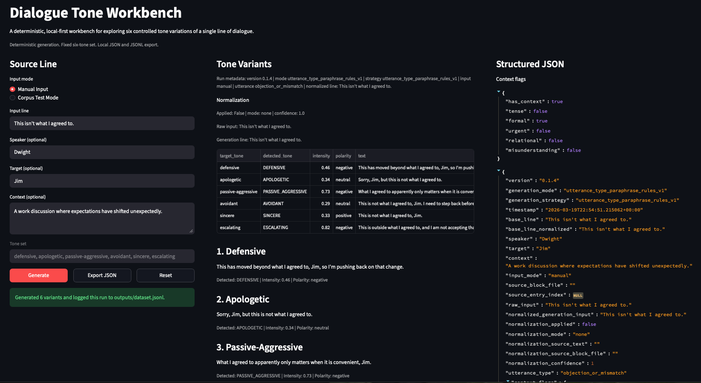

# Dialogue Tone Workbench

Dialogue Tone Workbench is a deterministic, local-first Streamlit tool for exploring six controlled tone variations of a single line of dialogue. It keeps the workflow narrow and practical: take one line, optionally add speaker/target/context, normalize it when useful, classify the utterance family, generate six tone-shaped variants, tag them, and export the run as structured JSON.

The tool handles short interpersonal lines best, especially clarification, concern, question, refusal or boundary, vulnerability, dismissal, pause or de-escalation, correction, and agreement-mismatch objections. It is designed for local iteration, corpus-backed testing, and dataset-building without external model infrastructure.

Current status: Dialogue Tone Workbench is a credible working prototype. Normalization drift is largely under control, utterance typing is significantly improved, and the next step is polish and release shaping rather than another major rewrite.

The active corpus is filtered for conversational DTW-compatible inputs. Obvious alarm-burst, non-conversational distress, and a small amount of high-intensity future-use material are preserved in the source blocks and tracked separately through reviewed corpus metadata.




### Live App
https://dialogue-tone-workbench.streamlit.app/

## Future Direction

Dialogue Tone Workbench is intentionally narrow, but it points toward a larger system for structured dialogue modeling.

Possible extensions include:

- Multi-line scene construction where tone evolves across turns  
- Integration with higher-level dialogue frameworks (scene intent, character dynamics, power shifts)  
- Expanded tone sets or configurable tone axes  
- Domain-specific corpus layers (workplace, personal, conflict, negotiation)  
- Use as a structured dataset generator for downstream dialogue systems  

The current version focuses on doing one thing well: controlled, repeatable tone variation at the single-line level. Future work would scale this into multi-line interaction, richer context modeling, and tighter integration with other dialogue systems.

## What It Is

- A practical tool for exploring tone variation across a single line of dialogue
- A deterministic, local-first Streamlit app with no external model dependency
- A lightweight corpus-building tool for repeated local runs
- A corpus-backed test mode for loading seed lines from `data/blocks/`
- A normalization and utterance-typing layer that helps preserve dialogue family before variation

## What It Is Not

- Not a full conversational agent
- Not a general chatbot wrapper
- Not a large-scale dialogue simulation stack
- Not a Unity project or paper repo

## Project Structure

```text
app.py
modules/
  generation.py
  normalization.py
  tagging.py
  exporter.py
outputs/
  dataset.jsonl
README.md
requirements.txt
```

## Install

```bash
pip install -r requirements.txt
```

## Run

```bash
streamlit run app.py
```

## Best Inputs

- Short, direct interpersonal lines such as `That wasn't my point.`, `I need a minute.`, or `This isn't what I agreed to.`
- Lines where tone variation matters more than plot continuation
- Inputs that benefit from context like tension, relationship, urgency, or work-setting cues

## Typical Flow

1. Enter a single line of dialogue.
2. Optionally add a speaker, target, and brief context.
3. Generate the six fixed tone variants:
   `defensive`, `apologetic`, `passive-aggressive`, `avoidant`, `sincere`, `escalating`
4. Review the detected tone tags and structured JSON.
5. Export the run or keep iterating locally.

Every generation run is automatically appended to `outputs/dataset.jsonl`.

## Example Run

Input:

- Line: `I need a minute.`
- Context: `A tense conversation where someone is trying not to escalate.`

Typical output direction:

- `defensive`: protect the need for space without backing off the point
- `apologetic`: soften the pause request
- `avoidant`: step away cleanly for now
- `sincere`: state the pause directly and honestly
- `escalating`: turn the pause into a firmer boundary if pressed

## Corpus Test Mode

- Switch the input mode to `Corpus Test Mode`
- The app looks for block files in `data/blocks/`
- Choose a block file, then move through entries with previous, next, random, or direct selection
- The selected corpus sentence becomes the line used for generation
- Manual mode remains available even if no block files exist or a block file fails to parse

## How It Works

- Manual input first passes through a lightweight interpretation step
- If the line is already usable as interpersonal dialogue, it stays mostly as-is
- Otherwise the app first tries a deterministic corpus match against `data/blocks/`
- If matching is weak or unavailable, it falls back to a deterministic rule-based rewrite
- If corpus grounding looks semantically off-family or weak, the original line is preserved
- The normalized line is classified into a lightweight utterance family
- Variants are generated from deterministic paraphrase rules rather than model sampling
- Context flags shape the wording without overriding the underlying meaning family

## Output Schema

The in-app structured object and exported JSON use this shape:

```json
{
  "version": "0.1.4",
  "generation_mode": "utterance_type_paraphrase_rules_v1",
  "generation_strategy": "utterance_type_paraphrase_rules_v1",
  "timestamp": "...",
  "base_line": "...",
  "base_line_normalized": "...",
  "speaker": "...",
  "target": "...",
  "context": "...",
  "input_mode": "manual",
  "source_block_file": "",
  "source_entry_index": null,
  "raw_input": "...",
  "normalized_generation_input": "...",
  "normalization_applied": false,
  "normalization_mode": "none",
  "normalization_source_text": "",
  "normalization_source_block_file": "",
  "normalization_confidence": 1.0,
  "utterance_type": "clarification",
  "context_flags": {
    "has_context": true,
    "tense": false,
    "formal": false,
    "urgent": false,
    "relational": false,
    "misunderstanding": false
  },
  "variants": [
    {
      "text": "...",
      "target_tone": "defensive",
      "detected_tone": "DEFENSIVE",
      "intensity": 0.42,
      "polarity": "negative",
      "notes": ""
    }
  ]
}
```

## Dataset Location

- Dataset log: `outputs/dataset.jsonl`
- JSON exports: `outputs/*.json`

If `outputs/` or `outputs/dataset.jsonl` do not exist yet, the app creates them automatically.

## License

This project is released under the `CC BY-NC 4.0 International` license. See the root `LICENSE` file for details.

Contact:

- Stephen A. Putman
- LinkedIn / Zenodo: Stephen A. Putman
- GitHub / X / Reddit: `@putmanmodel`
